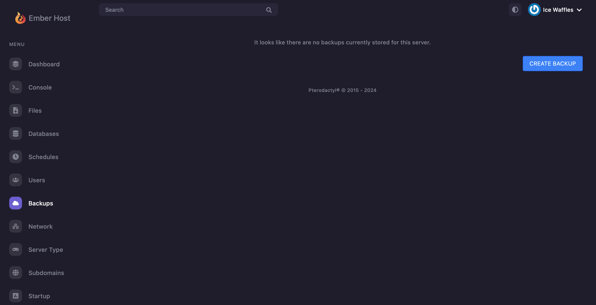
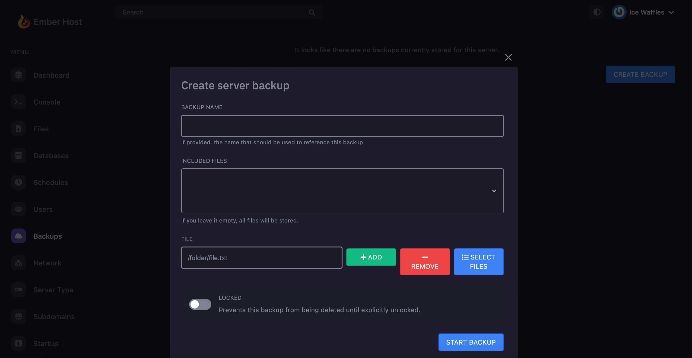
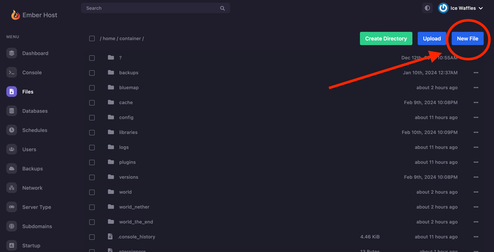
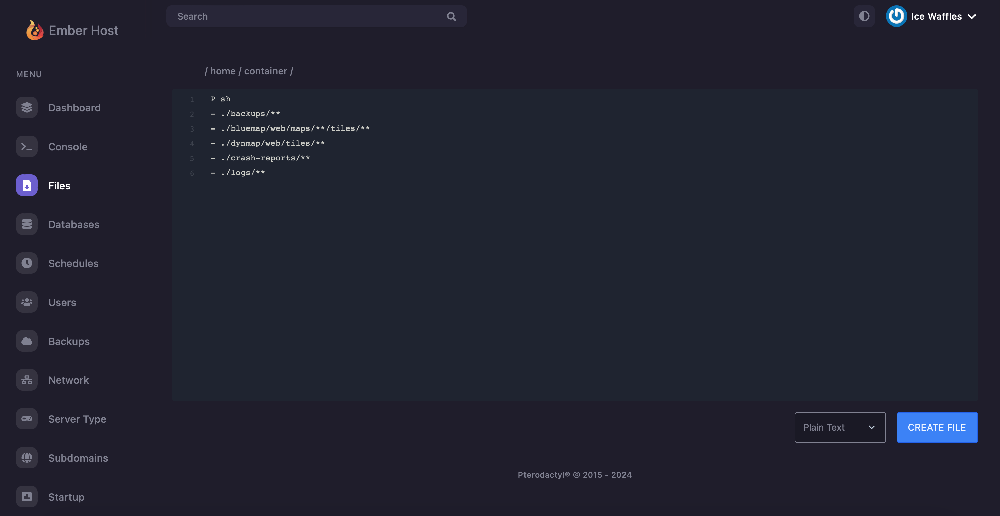
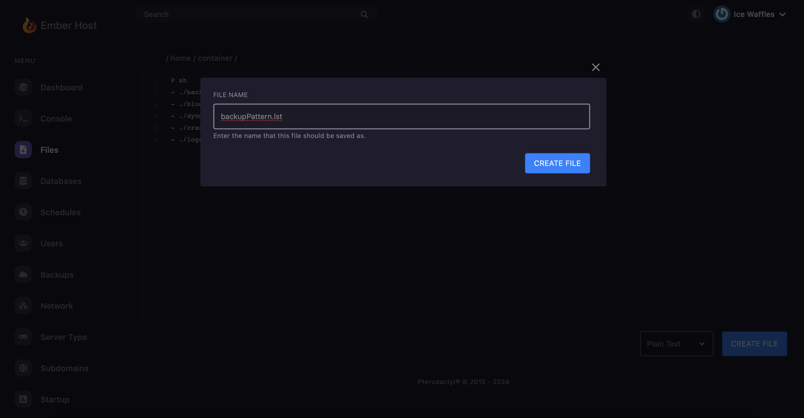

# Backups

### What Makes Us Different?&#x20;

Ember Host uses something called Borg backups, which has some huge benefits over the S3 backup system that comes with Pterodactyl by default: de-duplicated and incremental backups. This means that each individual backup taken will only include changes since the last backup - hugely decreasing the amount of time backups take after the first one is created.&#x20;

### Creating a Backup

Here's how to make a backup - start by heading over to the backups tab on our [panel](https://panel.ember.host), and click `Create Backup`.

<figure><figcaption><p>Ember Panel - Backups tab</p></figcaption></figure>

<figure><figcaption><p>Name your backup, lock it, or select which files to include here!</p></figcaption></figure>


Selecting files to include here will override the existing `backupPattern.lst`


### Creating Scheduled Backups

Schduled backups are simple - you can use our inbuilt schedules feature in our panel, which allows for automated backup creation at whatever times you specify. When you reach the backup limited, the oldest non-locked backup will be deleted to make space for the new one the schedule creates. Curious on how to create a schedule? Check out our page on [schedules](schedules.md)!

### Choosing Which Files Are Included in a Scheduled Backup

Go into the files tab of the panel. Then, click 'New File' -> type up your patternfile -> save it as `backupPattern.lst`

```P
- ./backups/**
- ./bluemap/web/maps/**/tiles/**
- ./dynmap/web/tiles/**
- ./crash-reports/**
- ./logs/**
```

_For Borg, lines in a pattern file start with + for include patterns and - for exclude patterns._ `- ./backups/**` tells Borg to exclude the backups directory and all its contents. The \*\* pattern matches any files and subdirectories recursively.

`- ./bluemap/web/maps/**/tiles/**` excludes all tiles directories under any directory within ./bluemap/web/maps/, including their contents.

`- ./dynmap/web/tiles/**` excludes all content within the ./dynmap/web/tiles/ directory, recursively.

`- ./crash-reports/** and - ./logs/**` exclude the crash-reports and logs directories respectively, along with all their contents.

<figure><figcaption><p>Ember Panel Files tab - new file</p></figcaption></figure>

<figure><figcaption><p>Typing up the example patternfile</p></figcaption></figure>

<figure><figcaption><p>Saving the patternfile</p></figcaption></figure>

### Further Examples&#x20;

To include a specific directory and all its contents: `+ /path/to/directory/**`&#x20;

To exclude a specific directory: `- /path/to/directory/**`&#x20;

To include all .yml files in a specific directory: `+ /path/to/directory/**/*.yml`&#x20;

To exclude all .log files: `- *.log`

By `@goldenedit` and `@icewaffles`
