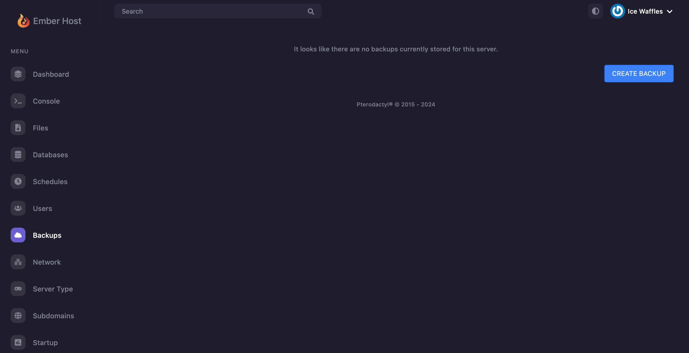
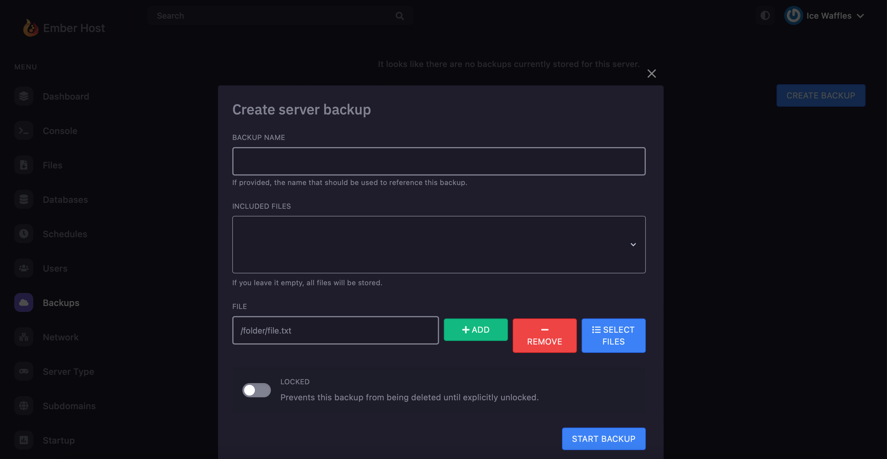
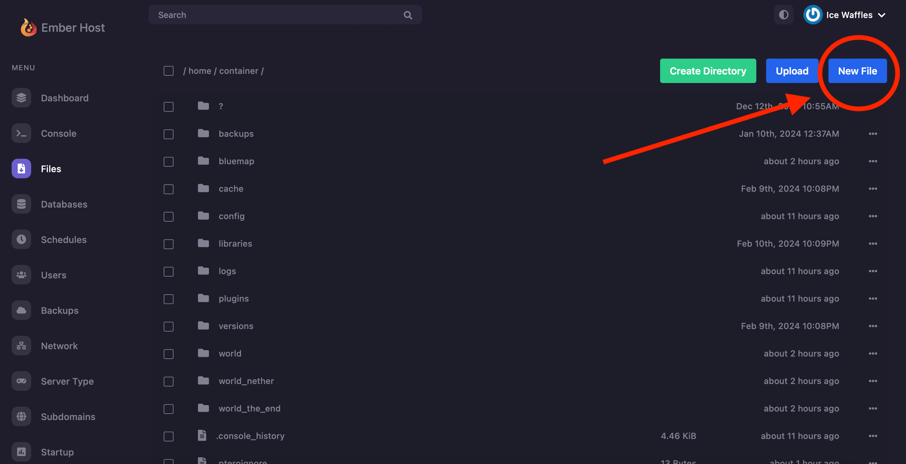
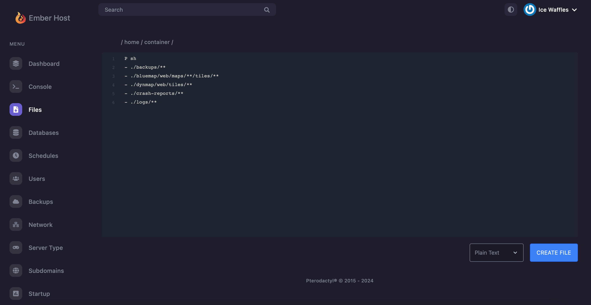
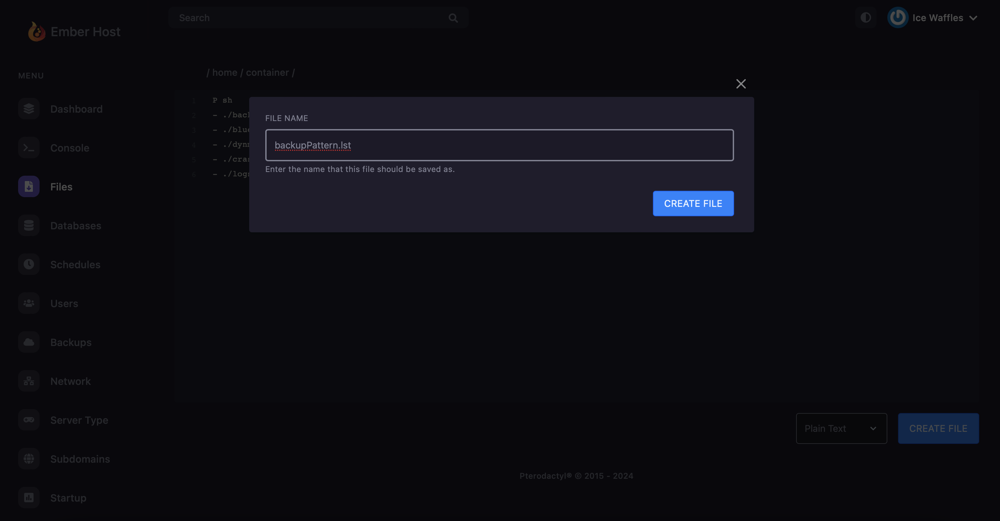

# Backups

### What Makes Us Different?&#x20;

Ember Host uses something called Borg backups, which has some huge benefits over the S3 backup system that comes with Pterodactyl by default: de-duplicated and incremental backups. This means that each individual backup taken will only include changes since the last backup - hugely decreasing the amount of time backups take after the first one is created.&#x20;

### Creating a Backup

Here's how to make a backup - start by heading over to the backups tab on our [panel](https://panel.ember.host), and click `Create Backup`.

<figure><figcaption><p>Ember Panel - Backups tab</p></figcaption></figure>

<figure><figcaption><p>Name your backup, lock it, or select which files to include here!</p></figcaption></figure>


Selecting files to include here will override the existing `.pteroignore`


### Creating Scheduled Backups

Schduled backups are simple - you can use our inbuilt schedules feature in our panel, which allows for automated backup creation at whatever times you specify. When you reach the backup limited, the oldest non-locked backup will be deleted to make space for the new one the schedule creates. Curious on how to create a schedule? Check out our page on [schedules](schedules.md)!

### Choosing Which Files Are Included in a Scheduled Backup

Go into the files tab of the panel. Then, click 'New File' -> type up your ignore patterns -> save it as `.pteroignore`

```gitignore
backups/
bluemap/web/maps/**/tiles/**
dynmap/web/tiles/**
crash-reports/
logs/
```

The `.pteroignore` file uses the same pattern format as `.gitignore`. Each line is a pattern for files or directories to exclude from backups. Patterns are relative to the root of your server directory.

`backups/` ignores the entire backups directory and all its contents.

`bluemap/web/maps/**/tiles/**` ignores all tiles directories nested within the bluemap directory, including their contents.

`dynmap/web/tiles/**` ignores all content within the dynmap web tiles directory.

`crash-reports/` and `logs/` ignore those directories and their contents.

To negate (include) a previously excluded pattern, prefix it with `!`.

<figure><figcaption><p>Ember Panel Files tab - new file</p></figcaption></figure>

<figure><figcaption><p>Typing up the example patternfile</p></figcaption></figure>

<figure><figcaption><p>Saving the patternfile</p></figcaption></figure>

### Further Examples&#x20;

To exclude a specific directory: `path/to/directory/`&#x20;

To exclude all .log files: `*.log`&#x20;

To exclude a file: `filename.txt`&#x20;

To negate (include) a previously excluded pattern: `!important-file.txt`&#x20;

To exclude everything except a specific directory:&#x20;

```gitignore
*
!important-directory/
!important-directory/**
```

By `@andyishereboi`, `@goldenedit` and `@icewaffles`
