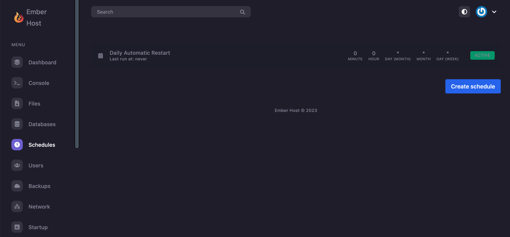
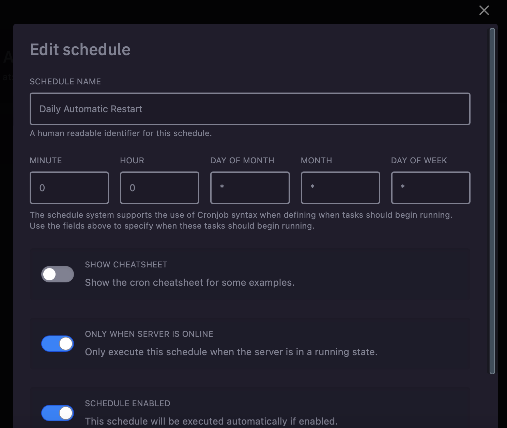
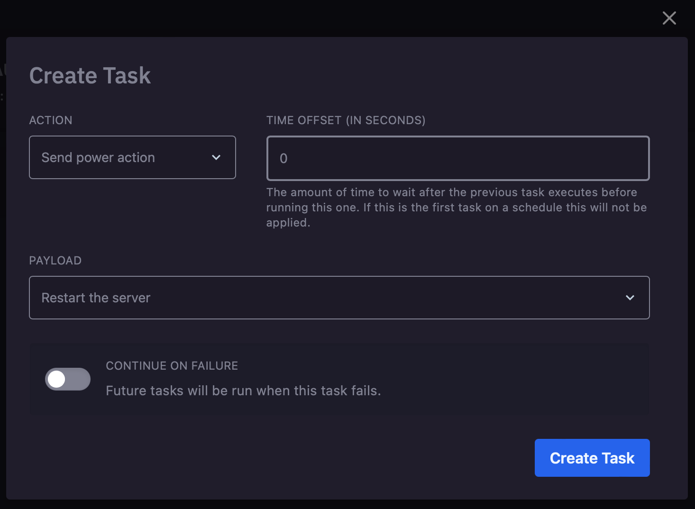
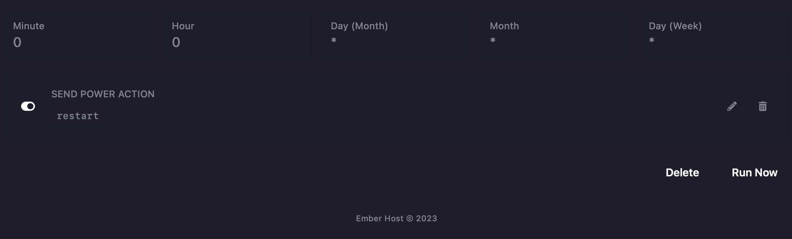

# Schedules

### Setup

Head over to the Ember Host panel and click on schedules on the sidebar. The page you see should show you a list of all existing schedules that will run.

To create a new schedule, click the button that reads `Create Schedule` and set a name for it. Then, set how often it will run - if you're confused, try toggling on the button that reads `Show Cron Cheatsheet` for help.

Once created, click into the schedule on the main list and click `New Task`. Now, you can just set whatever task you want to run on the tiems you schedules earlier. You can also specify a delay, so tasks don't all run at once. A good use for this is first sending a broadcast out to your players to let them know your server is about to restart, and have the server actually restart _after_ the broadcast is sent.

### Example

Here is an example of an automatic daily restart done with schedules.&#x20;

<figure><figcaption>
Main schedules page - list of all schedules
</figcaption></figure>

<figure><figcaption>
Setting the times for a schedule. This will make it restart once a day.
</figcaption></figure>

<figure><figcaption>
Setting what tasks on run at the time specified - in this case, it will restart the server.
</figcaption></figure>

<figure><figcaption>
What this specific schedule should look like once completed.
</figcaption></figure>

By `@icewaffles`
