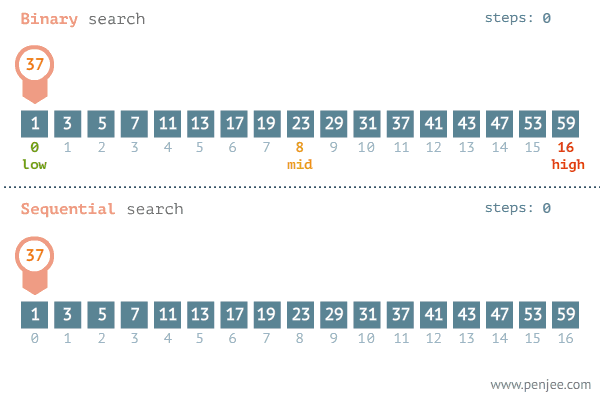

# Binary Search

### **Why Would I Need This?**

Whilst running a Minecraft server, a common issue is that unexpected behaviour is happening to the gameplay, a feature, or simply that something is not working at all - there's a bug. When you are certain an issue is not caused by the server software you are running (e.g. one of Purpur's configuration options), but rather, a plugin - but are not sure which plugin is the culprit - this is the time to conduct a binary search to quickly find the issue.

### **Step 1**

Be sure that your unexpected behaviour is not caused by your server software (e.g. forks of Paper like Purpur or Pufferfish). You can check by switching back to Paper if you're unsure. Make sure you've eliminated other external factors too: this includes startup flags, database details, open ports, and more!&#x20;

### Step 2 

Remove half of your plugins. To do this, select the plugins and move them outside of the `plugins` folder or delete them. After this, restart your server.

### Step 3 

If the problem is still occurring, now you know the bug lies within the remaining half of your plugins still installed. If you're still unsure which plugin is the issue, remove half of the remaining plugins again. On the other hand, if the problem has disappeared, you know the problem lies within the half of plugins you removed. In the same way, if you still don't know which one is the culprit, add back half of the removed plugins and restart your server again.

### Step 4 

You get the idea! Keep cutting things in half until you find the problematic plugin. This method is much faster than removing plugins one by one to check.

<figure><figcaption>
Binary vs sequential search
</figcaption></figure>

By `@icewaffles`
