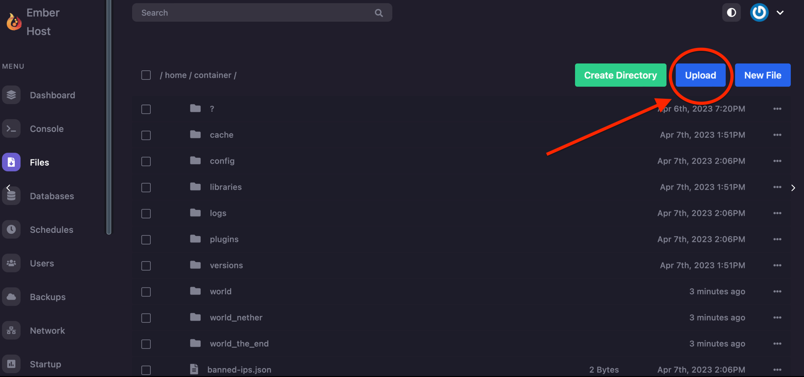

# Server Icon

### **Requirements**

1. You need an image that is 64 x 64 pixels. (Try using [https://genfavicon.com](https://genfavicon.com) to resize your icon/image if it isn't!)
2. The image must be in PNG format.
3. The image must be named `server-icon.png`.

### Setup

Start by either connecting your server via SFTP or in the 'files' tab on the web panel. If you're unsure how to manage your files, check out [our page on file management](../ember-panel/file-management.md).

Once you have gone to the files tab (or successfully connected to your server via SFTP), upload your 64 x 64 server icon named `server-icon.png` to your server's home directory. This means that it should not be uploaded into any particular folder!

<figure><figcaption>
Ember Host web panel
</figcaption></figure>

After you've successfully uploaded the file, just restart your server and the changes should be applied. Enjoy your server's new icon!

By `@icewaffles`
