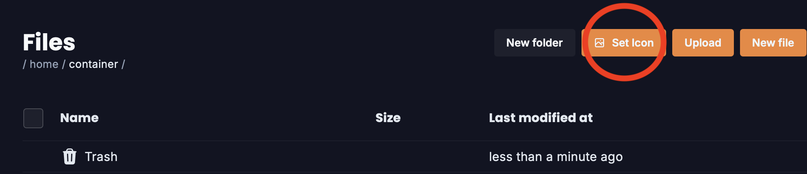

# Server Icon

### Introduction

There are two ways to set an icon for your Minecraft server: automatically \[via the set icon feature in the Ember Panel] or manually. Thus, this guide is split into two: one for those who want a quick automatic setup, or those who want more control and detail over their icon. If you want a more tailored and fitting icon, consider creating and uploading your icon manually.

### Automatic Setup

Prepare an PNG or JPG image on your computer, go to our web panel, click the files tab, and click this button:

<figure><figcaption></figcaption></figure>

Upload the image from your computer, and that's it! A Minecraft server icon is 64 x 64 pixels, so any image with too high a resolution will be pinned down to that resolution. Restart your server and you'll see your new icon.

### **Manual Setup Requirements**

1. You need an image that is 64 x 64 pixels. (Try using [https://genfavicon.com](https://genfavicon.com) to resize your icon/image if it isn't!)
2. The image must be in PNG format.
3. The image must be named `server-icon.png`.

### Setup

Start by either connecting your server via SFTP or in the 'files' tab on the web panel. If you're unsure how to manage your files, check out [our page on file management](../ember-panel/file-management.md).

Once you have gone to the files tab (or successfully connected to your server via SFTP), upload your 64 x 64 server icon named `server-icon.png` to your server's home directory. This means that it should not be uploaded into any particular folder!

After you've uploaded the image, just restart your server and the changes should be applied. Enjoy your server's new icon!

By `@icewaffles`
