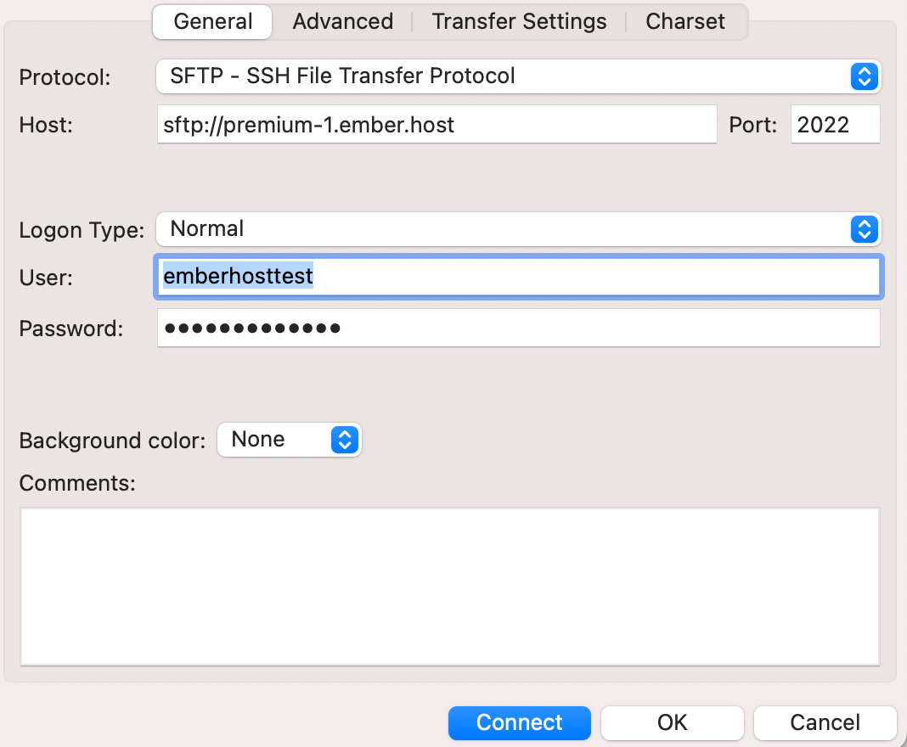

# File Management

### Managing via Web Panel

You can head on over to the files tab on your server panel. From there, you can check the box next to the file to perform any action on it (e.g. delete the file) or click into files to edit its contents (e.g. if you wanted to modify the `config.yml` of a plugin).

### Managing via SFTP

There are several SFTP clients, with some commonly used examples being [WinSCP](https://winscp.net/) and [FileZilla](https://filezilla-project.org/).\
\
To access your server files via SFTP, start by heading over to the settings tab, where you should see the details. Simply open your SFTP client, plug the correct details in right places and you're good to go!&#x20;

For example, if you were using FileZilla, it should look something like this:

<figure><figcaption>
Filezilla connection details
</figcaption></figure>


**Ports**&#x20;

If an IP address has a colon in the end which is followed by numbers, that would be the port. In this case, because the host address is `sftp://premium-1.ember.host:2022`, the port is just `2022`.


By `@icewaffles`
